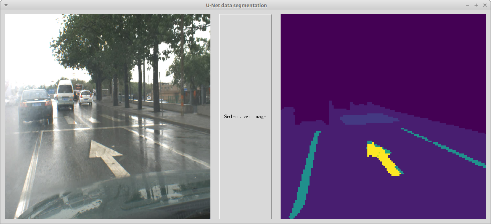

# unet_bioinspirada
Maquetacion final del proyecto de la Asignatura Computacion Bioinspirada

Se utiliza la red Unet para segmentacion junto con el datos del dataset COCO para realizar la segmentacion de un conjunto de imagenes etiquetadas previamente.

Es necesario instalar keras + tensorflow, tkinter y PILLOW para hacer funcionar el programa.

Ejemplo de funcionamiento:

El modelo ha sido extraido de:
  - https://github.com/petrosgk/Kaggle-Carvana-Image-Masking-Challenge/
